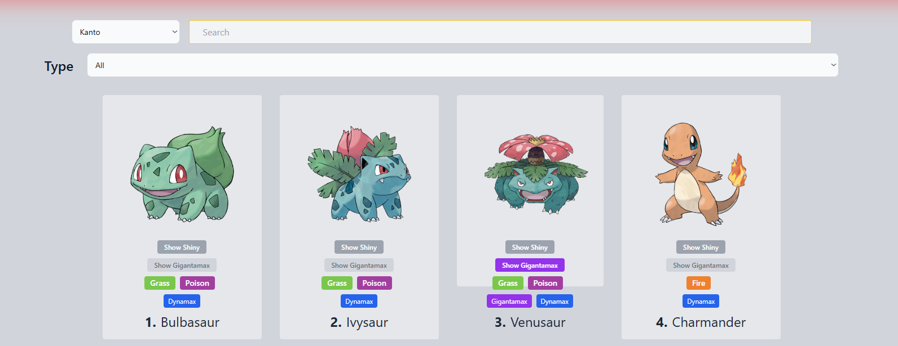

# My Updated Pokedex 🔍

A modern, interactive Pokedex application that allows users to search, filter, and explore Pokemon with their various forms and abilities.



## ✨ Features

### 🔍 **Smart Search & Filtering**
- **Regional Search**: Filter Pokemon by region (Kanto, Johto, Hoenn, etc.)
- **Type-based Filtering**: Search by Pokemon types (Fire, Water, Grass, etc.)
- **Advanced Search**: Find Pokemon by name, number, or characteristics

### 🌟 **Pokemon Forms & Variants**
- **Shiny Pokemon**: View and toggle shiny variants of your favorite Pokemon
- **Gigantamax Forms**: Explore special Gigantamax appearances
- **Regional Variants**: Discover different forms across regions

### 🎮 **Interactive Experience**
- **Dynamic Type Tags**: Color-coded type indicators for easy identification
- **Detailed Pokemon Cards**: Each Pokemon displays comprehensive information
- **Responsive Design**: Optimized for desktop and mobile devices

### 📊 **Pokemon Information**
- Pokemon names and numbers
- Type classifications with visual indicators
- Special form availability (Shiny, Gigantamax)
- High-quality Pokemon artwork and sprites

## 🚀 Getting Started

### Prerequisites
- Web browser (Chrome, Firefox, Safari, Edge)
- Internet connection for Pokemon data

### Installation

1. **Clone the repository**
   ```bash
   git clone https://github.com/rujisaranmalan/my-updated-pokedex.git
   ```

2. **Navigate to the project directory**
   ```bash
   cd my-updated-pokedex
   ```

3. **Open the application**
   ```bash
   npm install
   ```
   - Or use a local server for better performance:
   ```bash
   npm run dev
   ```

4. **Start exploring!**
   - Use the region dropdown to filter by area
   - Search for specific Pokemon in the search bar
   - Click on type filters to narrow down results
   - Toggle between regular and shiny forms

## 🎯 How to Use

### Basic Search
1. Select a region from the dropdown menu
2. Type a Pokemon name in the search bar
3. Use the "Type" dropdown to filter by Pokemon types

### Viewing Pokemon Details
- Each Pokemon card shows:
  - Pokemon artwork/sprite
  - Name and Pokedex number
  - Type badges (color-coded)
  - Available special forms

### Special Features
- **Show Shiny**: Click to view shiny variants
- **Show Gigantamax**: View special Gigantamax forms where available
- **Type Filtering**: Click on type badges to filter by that type

## 🛠️ Technologies Used

- **Frontend**: HTML5, CSS3, JavaScript (ES6+)
- **Styling**: Modern CSS with Flexbox/Grid layouts
- **API Integration**: Pokemon API for data fetching and Graphql
- **Responsive Design**: Mobile-first approach

## 📱 Browser Support

- ✅ Chrome (recommended)
- ✅ Firefox
- ✅ Safari
- ✅ Edge
- ✅ Mobile browsers

## 🎨 Design Features

- **Clean Interface**: Minimalist design focused on Pokemon data
- **Color-coded Types**: Intuitive type system with distinct colors
- **Smooth Animations**: Engaging hover effects and transitions
- **Accessibility**: Keyboard navigation and screen reader support

## 🔄 Recent Updates

- ✨ Added regional filtering capabilities
- 🌟 Implemented shiny Pokemon toggle
- 🔍 Enhanced search functionality
- 📱 Improved mobile responsiveness
- 🎨 Updated UI with modern design patterns

## 🐛 Known Issues

- Loading times may vary based on internet connection
- Some Pokemon sprites may take time to load initially
- Regional variants data might need updates for newer generations

## 📋 Future Enhancements

- [ ] Pokemon evolution chains
- [ ] Battle statistics and move sets
- [ ] Pokemon comparison tool
- [ ] Favorites/bookmark system
- [ ] Advanced filtering options
- [ ] Pokemon team builder
- [ ] Offline mode support

## 📄 License

This project is licensed under the MIT License - see the [LICENSE](LICENSE) file for details.

## 👤 Author

**Rujisaran Malan**
- GitHub: [@rujisaranmalan](https://github.com/rujisaranmalan)
- Project Link: [https://github.com/rujisaranmalan/my-updated-pokedex](https://github.com/rujisaranmalan/my-updated-pokedex)

## 🙏 Acknowledgments

- Pokemon artwork and data from official Pokemon sources
- Inspiration from the Pokemon community
- Thanks to all contributors and users

## 🔗 Related Projects

- Original Pokemon games by Nintendo/Game Freak
- PokeAPI for Pokemon data
- Pokemon community resources

---

**Happy Pokemon hunting! Gotta catch 'em all! 🎯**

*Made with ❤️ by a Pokemon enthusiast*
